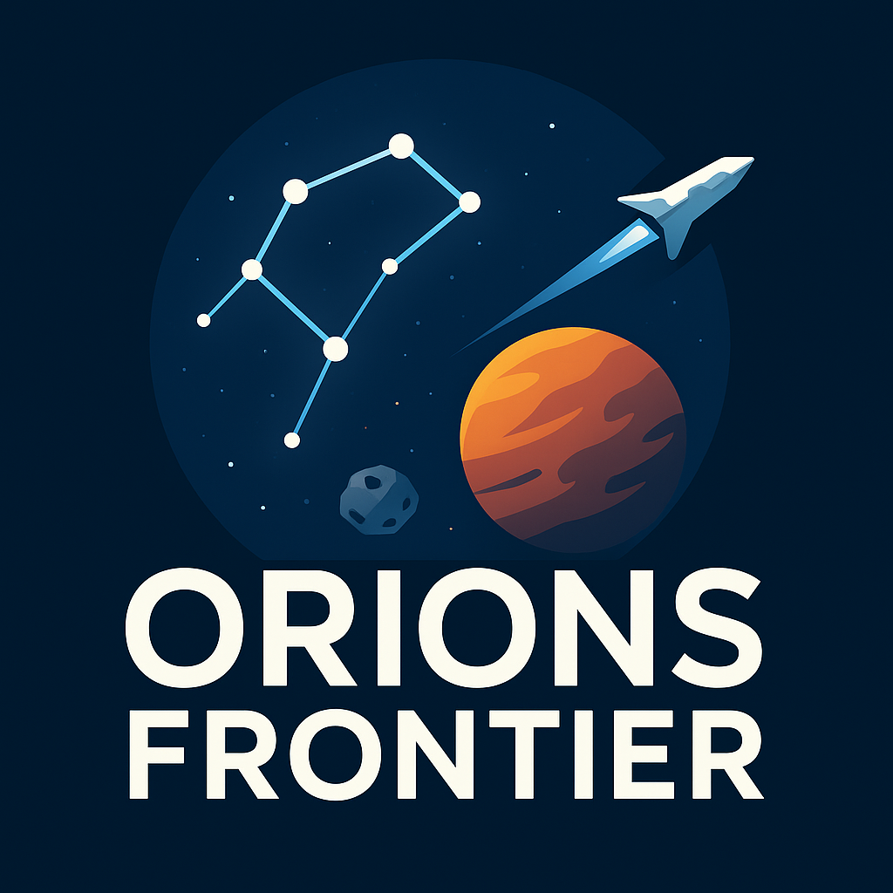

# Orions Frontier

**Mein persönliches Space-Game-Projekt**

Seit vielen Jahren wollte ich ein eigenes Browsergame erschaffen – inspiriert von den großen Klassikern, aber mit meiner eigenen Vision. Nach zahllosen Anläufen und verworfenen Versionen ist daraus endlich ein Spiel entstanden, das dich in eine dynamische Galaxie voller Raumschiffe, Raumstationen und Asteroiden eintauchen lässt.

Im Zentrum steht der Orion-Gürtel – eine der bekanntesten Sternenkonstellationen des Universums. In *Orions Frontier* dreht sich alles um die Erkundung, den Abbau von Ressourcen und die Eroberung dieses Sektors. Baue deine Flotte aus, erweitere deine Raumstation und sichere dir deinen Platz im Herzen des Orion!

Das Spiel ist live: [https://game.nimbuscms.app/](https://game.nimbuscms.app/)

---

## Features

- **Raumschiffe:** Schalte neue Schiffe frei und stelle eine mächtige Flotte zusammen.
- **Raumstationen:** Erweitere und upgrade deine Raumstation mit verschiedenen Modulen, um neue Funktionen und Vorteile zu erhalten.
- **Ressourcenabbau:** Baue Asteroiden auf einer interaktiven Karte ab und sichere dir wertvolle Rohstoffe.
- **PvP:** Kämpfe gegen andere Spieler und beweise dich im Universum.
- **Handel:** Tausche Ressourcen und Waren mit anderen Spielern.

## Roadmap

- [ ] **Ranking:** Spieler-Ranking basierend auf gesammeltem Einfluss.
- [ ] **Einfluss sammeln:** Erweitere deinen Machtbereich im Universum.
- [ ] **PvE:** Stelle dich KI-Herausforderungen.
- [ ] **Logbook:** Protokolliert wichtige Ereignisse wie Asteroidenabbau, Kämpfe und mehr.
- [ ] **Forschung:** Forsche an neuen Technologien und verbessere deine Flotte.
- [ ] **Salvaging:** Gewinne zusätzliche Ressourcen, indem du Trümmerfelder nach Kämpfen plünderst.

## Tech Stack

- **Frontend:** Vue.js, Tailwind CSS
- **Backend:** Laravel, Inertia.js

## Getting Started

### Step 1: clone the Repository

``` bash
git clone https://github.com/momoathome/project-browsergame.git
```

### Step 2: Install dependencies and create Docker container with sail

``` bash
# install composer Dependencies for existing App in sail
docker run --rm \
    -u "$(id -u):$(id -g)" \
    -v "$(pwd):/var/www/html" \
    -w /var/www/html \
    laravelsail/php83-composer:latest \
    composer install --ignore-platform-reqs
```

### Step 3: Install NPM Packages

``` bash
npm install
```

### Step 4: Configure Environment Variables

Create a copy of the .env.example file and rename it to .env.

``` bash
cp .env.example .env
```

### Step 5: Container starten

``` bash
./vendor/bin/sail up -d
```

### Step 6: Generate Application Key

Generate a new application key. This step is crucial for application security.

``` bash
./vendor/bin/sail artisan key:generate   
```

### Step 7: Update Environment Settings

Edit the .env file with the following entries

``` md
DB_CONNECTION=pgsql
DB_HOST=pgsql
DB_PORT=5432
DB_DATABASE=laravel
DB_USERNAME=sail
DB_PASSWORD=password
CACHE_STORE=redis

PUSHER_APP_ID="YOUR ID"
PUSHER_APP_KEY="YOUR KEY"
PUSHER_APP_SECRET="YOUR SECRET"
PUSHER_HOST=
PUSHER_PORT=443
PUSHER_SCHEME="https"
PUSHER_APP_CLUSTER="mt1"

VITE_PUSHER_HOST=
VITE_PUSHER_PORT="${PUSHER_PORT}"
VITE_PUSHER_APP_ID="${PUSHER_APP_ID}"
VITE_PUSHER_APP_SECRET="${PUSHER_APP_SECRET}"
VITE_PUSHER_APP_KEY="${PUSHER_APP_KEY}"
VITE_PUSHER_CLUSTER="${PUSHER_APP_CLUSTER}"

SCOUT_DRIVER=meilisearch
SCOUT_QUEUE=false
MEILISEARCH_HOST=http://meilisearch:7700
MEILISEARCH_KEY=masterKey
```

### Step 8: Run Database Migrations

Perform database migrations with the following command. This will set up your database schema and seed the Database

``` bash
./vendor/bin/sail artisan migrate:fresh --seed
```

### Step 9: Index your database for faster search

``` bash
./vendor/bin/sail artisan scout:import "Orion\Modules\Asteroid\Models\Asteroid"
./vendor/bin/sail artisan scout:index "Orion\Modules\Asteroid\Models\Asteroid"
./vendor/bin/sail artisan scout:import "Orion\Modules\Station\Models\Station"
./vendor/bin/sail artisan scout:index "Orion\Modules\Station\Models\Station"
./vendor/bin/sail artisan meilisearch:configure
```

### Step 10: dump-autoload

``` bash
./vendor/bin/sail composer dump-autoload
```

## Commands

``` bash
sail artisan db:seed --class=AsteroidSeeder
sail artisan game:generate-test-stations --count=25 --use-regions
sail artisan game:cleanup-test-stations --all
sail artisan universe:reserve-regions 50 --refresh
sail artisan test:station-spawns 50 --refresh --debug --clear-cache --reserve-regions=0 --test-reserved --show-all
sail artisan make:extended ModelNamen --m --c --r --s
```

---

## Lizenz

Dieses Projekt ist ein persönliches Herzensprojekt und **nicht für die kommerzielle Nutzung oder das eigenständige Re-Releasen** bestimmt.  
Das Clonen zu privaten Lernzwecken ist in Ordnung, aber eine Veröffentlichung, Weiterverbreitung oder kommerzielle Nutzung ist ausdrücklich untersagt.

## Feedback

Feedback gerne über [GitHub Issues](https://github.com/momoathome/project-browsergame/issues).

**Viel Spaß beim Erkunden des Universums!**

- [@momoathome](https://github.com/momoathome) - Maurice
